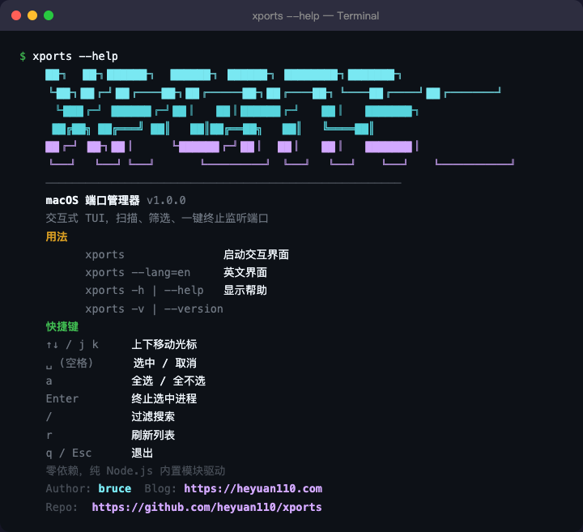

# XPorts

[English](README.md) | [中文](README.zh-CN.md)

macOS 交互式终端端口管理器 — 扫描、筛选、一键终止监听端口。


## 特性

- **零依赖** — 纯 Node.js 内置模块，无需安装任何第三方包
- **交互式 TUI** — 全键盘操作，告别鼠标
- **智能标注** — 自动识别常见服务（MySQL、Redis、Nginx、Docker...）
- **多选批量终止** — 选中多个端口一键 kill
- **实时过滤** — 按 `/` 输入关键词，按端口号、进程名、描述搜索
- **中英双语** — `--lang=zh` 中文（默认） / `--lang=en` 英文
- **系统进程识别** — 系统服务（AirPlay、rapportd 等）灰色显示
- **Docker 识别** — Docker 映射端口蓝色高亮

## 截图

### `xports --help`



### `xports`


## 安装

### npm（推荐）

```bash
npm install -g xports
```

### 手动安装

```bash
git clone https://github.com/heyuan110/xports.git
cd xports
npm link
```

### 单文件安装

```bash
curl -o /usr/local/bin/xports https://raw.githubusercontent.com/heyuan110/xports/main/bin/xports
chmod +x /usr/local/bin/xports
```

## 使用

```bash
xports                # 启动交互界面（默认中文）
xports --lang=en      # 英文界面
xports --lang=zh      # 中文界面
xports -h | --help    # 显示帮助
xports -v | --version # 显示版本
```

## 快捷键

| 按键 | 功能 |
|------|------|
| `↑` `↓` / `j` `k` | 上下移动光标 |
| `空格` | 选中 / 取消当前项 |
| `a` | 全选 / 全不选 |
| `Enter` | 终止选中进程（需确认） |
| `/` | 过滤搜索 |
| `r` | 刷新列表 |
| `q` / `Esc` | 退出 |

## 工作原理

XPorts 通过调用 `lsof -iTCP -sTCP:LISTEN -nP` 扫描 Mac 上所有监听的 TCP 端口，解析输出结果，使用 ANSI 转义码渲染交互式 TUI 界面。无需任何外部依赖，仅使用 Node.js 内置模块（`child_process`、`readline`）。

## 环境要求

- macOS（依赖 `lsof` 命令）
- Node.js >= 14

## 开源协议

[MIT](LICENSE)

## 作者

**bruce** — [heyuan110.com](https://heyuan110.com)
